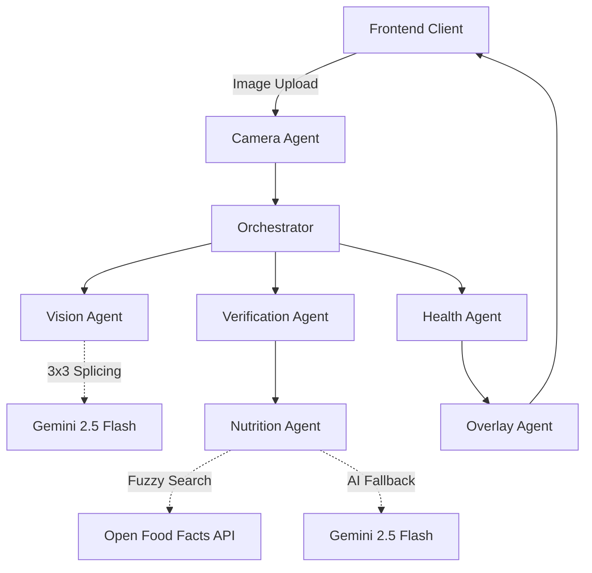

<div align="center">
  
</div>

<h1 align="center">🛒 Grocery Scanner AI</h1>

<div align="center">
  <strong>A Multi-Agent System for Real-time Grocery Shelf Analysis & Health Scoring</strong>
</div>
<br>

<div align="center">
  
  
  
  
</div>

<br>

Welcome to **Grocery Scanner AI**! We're all drowning in products at the supermarket, and for most of them, we don't even know what they do to our bodies. This app clearly marks the healthy ones without even needing to scan their barcodes.

Using Google's cutting-edge **Gemini 2.5 Flash** vision models and a robust multi-agent architecture, the scanner reads entire supermarket shelves and identifies products. It then instantly cross-checks them against the world's largest food and health databases (like *Open Food Facts*) to generate real-time AR-style UI health indicators right over your camera feed.

If you are a developer interested in LLM Orchestration, Computer Vision, or just making food healthier, **we want your help to build this!**

---

## ✨ Features

- **Multi-Product Recognition**: Scans an entire shelf and identifies dozens of products simultaneously using a 3x3 parallel image slicing grid constraint.
- **Autonomous Multi-Agent Pipeline**: Specialized AI Agents (`Vision`, `Nutrition`, `Health`) work seamlessly together to process images and data.
- **Nutrition Database + AI Fallback**: Primarily sources authoritative data from the *Open Food Facts* API. If a product is missing, Gemini 2.5 infers estimated health metrics on the fly!
- **Nutri-Score & NOVA Alignment**: Evaluates foods based on European standard health scoring systems to determine if a product gets a Green, Yellow, Orange, or Red overlay rating.
- **Persistent Local Caching**: Minimizes API latency by learning and saving the nutritional information of previously scanned products.

## 🏗 System Architecture

The project strictly follows a **Multi-Agent Architecture**, with separate single-responsibility files for each stage of the AI pipeline. 



1. **`cameraAgent.js`**: Handles base64 buffering, rotation, and resizing.
2. **`orchestrator.js`**: The task manager. Routes data sequentially between all other agents.
3. **`visionAgent.js`**: Slices the image into a 3x3 grid, queries Gemini Vision in parallel to find exact shelf coordinates (X/Y) of all products.
4. **`verificationAgent.js`**: Deduplicates AI hallucinations and validates identified products.
5. **`nutritionAgent.js`**: Fetches real health properties from Open Food Facts, caches data locally, and uses an AI fallback if unknown.
6. **`healthAgent.js`**: Analyzes the raw nutritional values to assign a health score.
7. **`overlayAgent.js`**: Injects precise spatial UI overlays over the original image.

## 🚀 Getting Started

Want to run the Grocery Scanner locally? Here's how to spin it up in under 5 minutes.

### 1. Prerequisites
- **Node.js** v18 or higher
- A **Gemini API Key** from [Google AI Studio](https://aistudio.google.com/app/apikey)

### 2. Installation
Clone the repository and install dependencies:
```bash
git clone https://github.com/humanchaos/grocery-scanner.git
cd grocery-scanner
npm install
```

### 3. Configuration
Copy the `.env.example` file to create your own configuration file:
```bash
cp .env.example .env
```
Open `.env` and paste in your Gemini API Key:
```env
GEMINI_API_KEY=your_key_here
PORT=3000
```

Because camera feeds require secure contexts on mobile browsers, the server attempts an HTTPS boot by default. Make sure to generate local certs, or run the app purely on `localhost`.

### 4. Start the Application
```bash
npm run dev
```
Open `https://localhost:3000` on your smartphone (or desktop) to start scanning!

## 🤝 Contributing

We are looking for Open Source contributors! Grocery Scanner AI is still in its early stages, and there are countless ways to improve it. 

Whether you're fixing a bug, updating documentation, tweaking the UI css, or implementing an entirely new AI agent, we'd love to review your pull request.

**Please check out our [Contributing Guidelines](CONTRIBUTING.md) to understand how to submit your work!**

### High Priority Bounties:
If you want to contribute but don't know where to start, here are areas we currently need help with:
1. **Client-side Image Resize**: Moving `sharp` resizing logic from the Node.js backend to the iPhone Safari browser to reduce cellular upload times.
2. **Streaming AI Pipelines**: Changing the `Orchestrator` to stream results as they finish processing, rather than waiting for all 9 vision tiles to load.
3. **Language Localization**: Adding French and German translation layers to the frontend application.

## ⚖️ License

This project is licensed under the MIT License - see the `LICENSE` file for details.
